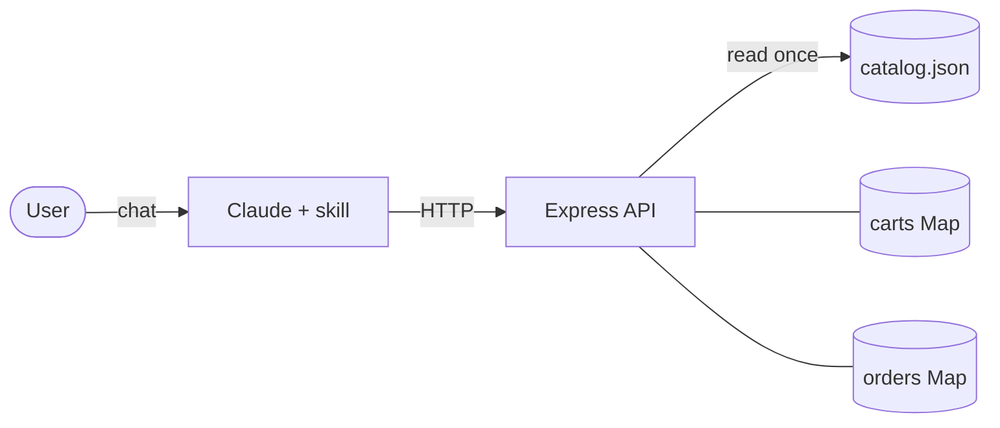

# Architecture

## Flow

```
User (chat)
    │
    ▼
Claude (with agentbazaar-shop skill loaded)
    │  reads SKILL.md, knows base URL
    │
    ├─── GET /manifest ──────────────────────────────┐
    │    discovers actions, params, policies          │
    │                                                 │
    ├─── GET /search?q=...&size=...&max_price=...     │
    │                                                 │
    ├─── GET /product/:id                             │
    │                                                 │
    ├─── POST /cart                                   │
    │                                                 │
    ├─── POST /checkout                               │
    │                                                 │
    └─── GET /order/:id                               │
                                                      │
                   Express API (Node 20 / Express 4)  │
                           │                          │
                           └── catalog.json ◄─────────┘
                               (read once at startup)
                           │
                           ├── carts Map (in-memory)
                           └── orders Map (in-memory)
```

Or as a Mermaid diagram:



## The /manifest pattern

`GET /manifest` is the discovery endpoint that makes AgentBazaar extensible. It returns a structured JSON document describing:

- Every action the API supports (name, method, path, params, example)
- The currency and policies (shipping, returns, demo disclaimer)
- Links to source and license

An agent that reads `/manifest` can operate the entire store without any hardcoded knowledge of endpoint shapes. This is the key design principle: **the API is self-documenting at runtime, not just in static docs**.

This is analogous to how a browser reads a page's `<meta>` tags and `sitemap.xml`, but for agents instead of crawlers. Any storefront that publishes a `/manifest`-style capabilities document becomes immediately agent-operable.

## Data persistence

Carts and orders are stored in Node.js `Map` objects and reset on server restart. This is intentional for a demo: no database means zero infrastructure, and the `/manifest` already discloses that all transactions are simulated.

For a real deployment you would swap the `Map`s in `lib/store.js` for a database client without touching any route code.
